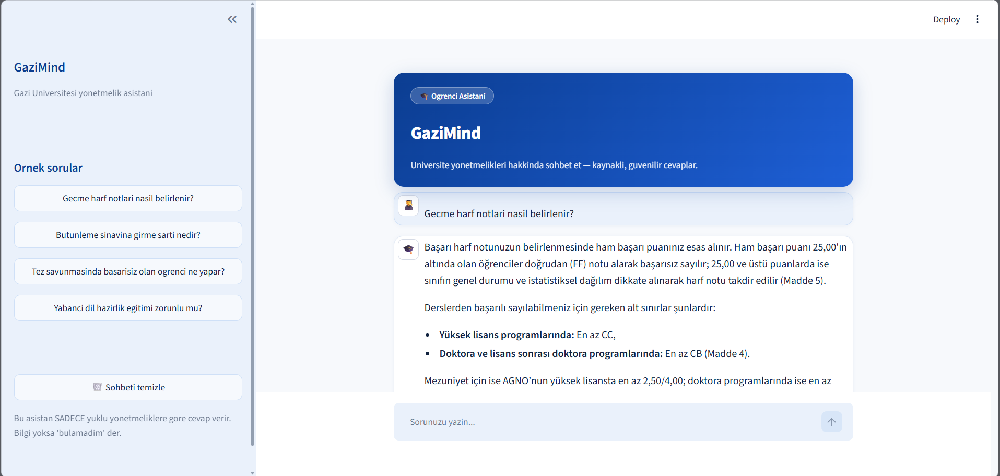
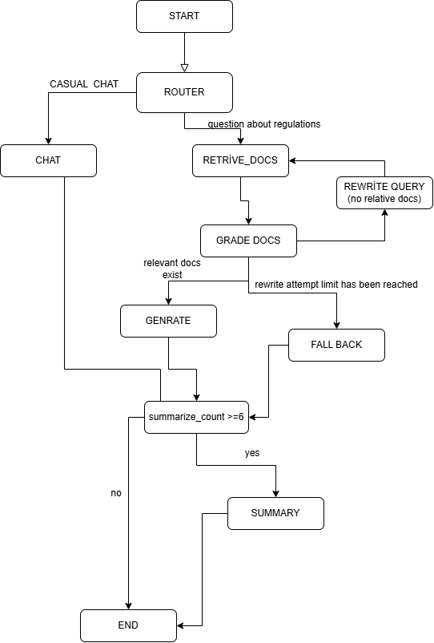

<p align="center">
  
</p>

<h1 align="center">GaziMind</h1>

<p align="center">
  <a href="#tr">🇹🇷 Türkçe</a> · <a href="#en">🇺🇸 English</a>
</p>



<a id="tr"></a>

## 🇹🇷 Türkçe

Gazi Üniversitesi yönetmelikleri hakkında kaynaklı cevaplar veren, LangGraph tabanlı bir RAG asistanı.

### Kullanılan Teknolojiler

- **Google Gemini:** LLM ve embedding modeli
- **LangGraph:** ajan akışı
- **SQLite:** LangGraph checkpointer ile sohbet hafızası. Her kullanıcının konuşması `thread_id` ile saklanır.
- **LangChain + Chroma:** vektör veritabanı ve retrieval
- **Docling:** PDF'leri parse edip başlık yapısına göre chunk'lama
- **FastAPI:** backend API
- **Streamlit:** chat arayüzü

### Akış Diyagramı



Klasik "soru → ara → cevapla" zinciri yerine, her adımda karar veren bir graf kurdum:

1. **Router:** Gelen mesajı sınıflandırır. "Selam" gibi sohbet mesajları doğrudan **Chat** node'una gider. Yönetmelik soruları doküman aramasına yönlenir.
2. **Retrieve Docs:** Chroma'dan soruya en yakın yönetmelik parçalarını getirir.
3. **Grade Docs:** LLM, getirilen parçaların soruyu gerçekten cevaplayıp cevaplamadığını değerlendirir. Sadece kelime benzerliği yeterli sayılmaz.
   - **Alakalıysa:** **Generate** node'u bu parçalara dayanarak, madde ve kaynak göstererek cevap üretir.
   - **Alakasızsa:** **Rewrite Query** soruyu resmî yönetmelik diline çevirir ("okuldan atılmak" → "ilişik kesilmesi") ve arama tekrarlanır.
   - **Deneme limiti dolarsa:** **Fallback** devreye girer. Bilgi uydurulmaz, öğrenci Öğrenci İşleri'ne yönlendirilir.
4. **Summary:** Sohbet belirli bir uzunluğu geçince eski mesajlar özetlenip silinir. Böylece bağlam korunur, token maliyeti düşük kalır.

Her node'un sistem prompt'u `prompts/` klasöründe ayrı bir dosyada tutulur. Router ve grader, Pydantic şemasıyla structured output döndürür.

### Çalıştırma

```bash
pip install -r requirements.txt
python rag.py index                 # PDF'leri indeksle (.env içinde GEMINI_API_KEY gerekli)
uvicorn main:app --port 8000        # API
streamlit run streamlit_app.py      # Arayüz
```

---

<a id="en"></a>

## 🇺🇸 English

A LangGraph-based RAG assistant that answers questions about Gazi University regulations and cites its sources.

### Tech Stack

- **Google Gemini:** LLM and embedding model
- **LangGraph:** agent workflow
- **SQLite:** conversation memory via the LangGraph checkpointer. Each user's conversation is stored by `thread_id`.
- **LangChain + Chroma:** vector database and retrieval
- **Docling:** parses PDFs and chunks them by heading structure
- **FastAPI:** backend API
- **Streamlit:** chat interface

### Workflow


Instead of a plain "question → search → answer" chain, I built a graph that makes a decision at every step:

1. **Router:** Classifies the incoming message. Small talk such as "hello" goes straight to the **Chat** node. Regulation questions go to document search.
2. **Retrieve Docs:** Fetches the most relevant regulation chunks from Chroma.
3. **Grade Docs:** An LLM checks whether the retrieved chunks actually answer the question. Keyword overlap alone is not enough.
   - **Relevant:** The **Generate** node writes an answer grounded in those chunks, citing the article and source.
   - **Not relevant:** **Rewrite Query** rephrases the question into formal regulatory terms, and the search runs again.
   - **Retry limit reached:** **Fallback** takes over. It never invents information and refers the student to Student Affairs.
4. **Summary:** Once the conversation gets long, older messages are summarized and removed. This keeps the context while keeping token costs low.

Each node's system prompt lives in its own file under `prompts/`. The router and the grader return structured output through Pydantic schemas.

### Getting Started

```bash
pip install -r requirements.txt
python rag.py index                 # Index the PDFs (requires GEMINI_API_KEY in .env)
uvicorn main:app --port 8000        # API
streamlit run streamlit_app.py      # UI
```
